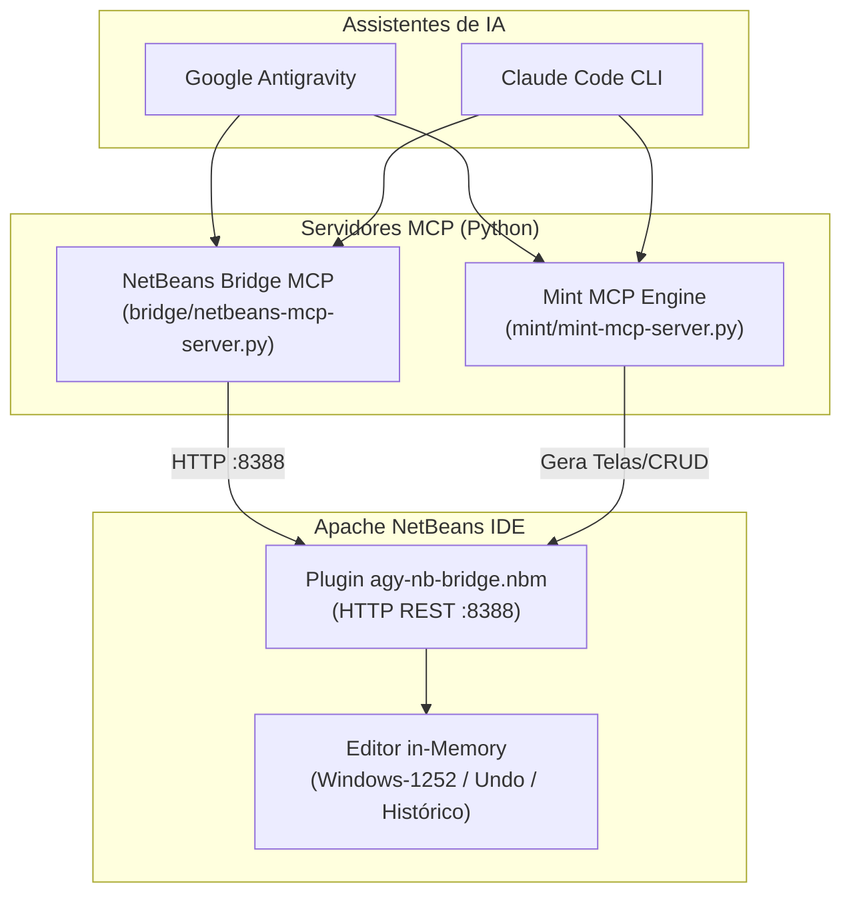

# 📚 WIKI: Manual de Instalação e Operação — NetBeans Bridge & Mint MCP

| Metadado | Detalhe |
| :--- | :--- |
| **Identificador** | `WIKI-ENG-BRIDGE-MINT-01` |
| **Status** | 🟢 **Homologado / Produção (v1.4.5)** |
| **Público-Alvo** | Engenheiros de Software, Desenvolvedores JPosto/Java e Equipe de IA |
| **Sistemas Alvo** | Google Antigravity & Claude Code CLI |
| **Última Revisão** | Setembro / 2026 |

---

## 📑 Sumário de Navegação Rápida

1. [Visão Geral & Matriz de Arquitetura](#1-visão-geral--matriz-de-arquitetura)
2. [Matriz de Componentes & Repositórios](#2-matriz-de-componentes--repositórios)
3. [Instalação no Google Antigravity](#3-instalação-no-google-antigravity)
   - 3.1. [NetBeans Bridge Suite](#31-netbeans-bridge-suite)
   - 3.2. [Mint (Miti) Boilerplate Engine](#32-mint-miti-boilerplate-engine)
4. [Instalação no Claude Code](#4-instalação-no-claude-code)
   - 4.1. [Registro Global dos MCPs](#41-registro-global-dos-mcps)
   - 4.2. [Diretriz de Operação (CLAUDE.md)](#42-diretriz-de-operação-claudemd)
5. [Procedimento de Atualização Diária (SOP)](#5-procedimento-de-atualização-diária-sop)
6. [Protocolo de Design de Telas Swing](#6-protocolo-de-design-de-telas-swing)
7. [Guia de Troubleshooting & FAQ](#7-guia-de-troubleshooting--faq)

---

## 1. Visão Geral & Matriz de Arquitetura

O ecossistema integra assistentes de Inteligência Artificial ao Apache NetBeans e ao ecossistema JBase através do protocolo **Model Context Protocol (MCP)** e de uma API HTTP local de alta performance:



---

## 2. Matriz de Componentes & Repositórios

| Componente | Tipo / Linguagem | Repositório Oficial | Pacote / Execução | Finalidade Principal |
| :--- | :--- | :--- | :--- | :--- |
| **NetBeans Bridge** | Plugin Java + Servidor Python | [`djonatansantos706/bridge`](https://github.com/djonatansantos706/bridge) | `.nbm` (176 KB) + Python 3 | Edição in-memory no NetBeans, AST, logs, debug e preservação de charset nativo. |
| **Mint (Miti)** | Motor Python Puro | [`djonatansantos706/mint`](https://github.com/djonatansantos706/mint) *(Privado)* | Scripts Python 3 / Pytest | Parser de planilhas `.ods`, geração de CRUD JBase (Entidade, BD, SC, SE, SQL) e Telas MVP. |

> [!NOTE]
> O **Mint** é um script Python (não utiliza `.nbm`). O único arquivo `.nbm` é o da **Bridge**, responsável por injetar código dentro da IDE.

---

## 3. Instalação no Google Antigravity

### 3.1. NetBeans Bridge Suite

Abra o terminal do Linux e execute:

```bash
# 1. Clonar o repositório
git clone https://github.com/djonatansantos706/bridge.git ~/bridge

# 2. Executar setup automatizado
~/bridge/setup_antigravity.sh
```

**Ações executadas pelo instalador:**
- Instala o arquivo `dist/agy-nb-bridge-latest.nbm` automaticamente nas pastas de módulos de todas as versões do NetBeans encontradas (`~/.netbeans/*/modules/`).
- Copia os 40 schemas `.json` e o `instructions.md` para `~/.gemini/antigravity/mcp/netbeans-bridge/`.
- Adiciona a regra permanente de preservação de buffer e preview de telas em `~/.gemini/config/rules/netbeans_bridge.md`.

> ⚠️ **Pós-Instalação:** Feche e reabra o Apache NetBeans. Verifique a mensagem `[Antigravity] Bridge Suite ativa na porta 8388` no rodapé da IDE.

---

### 3.2. Mint (Miti) Boilerplate Engine

No terminal, execute:

```bash
# 1. Clonar o repositório
git clone https://github.com/djonatansantos706/mint.git ~/mint

# 2. Executar setup automatizado
~/mint/setup_antigravity.sh
```

**Ações executadas pelo instalador:**
- Registra o servidor MCP `mint` no arquivo de configuração global `~/.gemini/config/mcp_config.json`.
- Copia os schemas (`mint_status`, `mint_parse_ods`, `mint_gerar_crud`, `mint_gerar_tela`, `mint_aprender`, `mint_gerar_tudo`) e instruções para `~/.gemini/antigravity/mcp/mint/`.
- Executa diagnóstico do ambiente Python e verifica a comunicação com a NetBeans Bridge.

---

## 4. Instalação no Claude Code

### 4.1. Registro Global dos MCPs

Execute os dois comandos abaixo no terminal da sua máquina:

```bash
# Registrar a NetBeans Bridge (escopo global do usuário)
claude mcp add --scope user netbeans-bridge python3 "$HOME/bridge/netbeans-mcp-server.py"

# Registrar o Mint (escopo global do usuário)
claude mcp add --scope user mint python3 "$HOME/mint/mint-mcp-server.py"
```

#### Verificação de Conectividade:
```bash
claude mcp list
```

**Resultado esperado:**
```text
Checking MCP server health…

netbeans-bridge: python3 /home/merito/bridge/netbeans-mcp-server.py (stdio) - ✔ Connected
mint:            python3 /home/merito/mint/mint-mcp-server.py (stdio)       - ✔ Connected
```

---

### 4.2. Diretriz de Operação (`CLAUDE.md`)

Adicione o bloco abaixo no seu arquivo `~/.claude/CLAUDE.md` ou na raiz do projeto Java:

```markdown
# Diretrizes Mandatórias de Engenharia

## 1. Edição de Código via NetBeans Bridge
- Utilize SEMPRE as ferramentas `nb_edit_buffer`, `nb_replace_lines` ou `nb_set_content`.
- NUNCA sobrescreva arquivos diretamente no disco para garantir a preservação do encoding (Windows-1252 / ISO-8859-1) e do histórico local / Undo (Ctrl+Z) na IDE.

## 2. Geração de Telas e CRUDs via Mint
- Utilize as ferramentas do `mint` (`mint_parse_ods`, `mint_gerar_crud`, `mint_gerar_tela`).
- NUNCA gere arquivos Swing (.form/.java) sem apresentar pré-visualização visual em HTML homologada pelo desenvolvedor.
```

---

## 5. Procedimento de Atualização Diária (SOP)

Quando houver novas versões, melhorias em templates ou novas ferramentas, execute 1 comando em cada diretório:

```bash
# Atualizar a NetBeans Bridge:
cd ~/bridge && ./update.sh

# Atualizar o Mint:
cd ~/mint && ./update.sh
```

| Etapa | O que o `./update.sh` executa automaticamente |
| :---: | :--- |
| **1** | Executa `git pull` para baixar a versão mais recente do código. |
| **2** | Atualiza os schemas MCP e instruções mestres do Antigravity. |
| **3** | Atualiza o `.jar` do plugin diretamente dentro do NetBeans (no caso da Bridge). |
| **4** | Executa a suíte de testes de validação (`qa_test.py` ou `pytest tests/`). |

---

## 6. Protocolo de Design de Telas Swing

Toda criação ou alteração de telas Swing no ecossistema obedece ao seguinte fluxo padrão:

1. **Geração do Preview HTML:** O assistente gera um preview HTML interativo no padrão **NetBeans Dark Look & Feel** (`#3c3f41`) usando como base o template `~/bridge/templates/template_preview_swing.html`.
2. **Modo de Revisão e Comentários:** O desenvolvedor clica nos componentes (botões, campos, tabelas) para adicionar observações. O texto digitado possui alto contraste forçado (`#ffffff` sobre `#1e1e1e`).
3. **Cópia de Feedback:** O desenvolvedor clica em **"📋 Copiar Feedback para o Chat"** e cola na conversa com o assistente (`Ctrl+V`).
4. **Criação Física:** Apenas após aprovação expressa, o assistente aciona `mint_gerar_tela` ou `nb_form_create_blueprint` via Bridge.

---

## 7. Guia de Troubleshooting & FAQ

### Q1: O colega recebeu `fatal: repository 'https://github.com/.../mint.git' not found (404)`
- **Causa:** O repositório `djonatansantos706/mint` é **PRIVADO** por questões de sigilo dos dados da Mérito.
- **Solução:** Acesse [Configurações de Colaboradores](https://github.com/djonatansantos706/mint/settings/access) e adicione o usuário do GitHub do colega clicando em **"Add people"**.

### Q2: Erro `fatal: destination path '/home/merito/mint' already exists`
- **Causa:** O desenvolvedor já possui a pasta clonada e tentou executar `git clone` novamente.
- **Solução:** Como a pasta já existe, basta rodar diretamente:
  ```bash
  cd ~/mint && ./update.sh
  ```

### Q3: `NetBeans Bridge offline (porta 8388)`
- **Causa:** O Apache NetBeans não está aberto ou o plugin ainda não foi carregado.
- **Solução:**
  1. Abra o Apache NetBeans.
  2. Caso tenha acabado de instalar, feche e reabra o NetBeans para o módulo subir.
  3. Verifique a mensagem no rodapé: `[Antigravity] Bridge Suite ativa na porta 8388`.

### Q4: O texto digitado nos comentários de preview de tela não aparecia no tema escuro
- **Causa:** O navegador ou IDE em modo escuro herdava cor preta no campo de texto.
- **Solução:** Corrigido na versão 1.4.5 com a classe `.comment-textarea` (`background: #1e1e1e !important; color: #ffffff !important;`).
